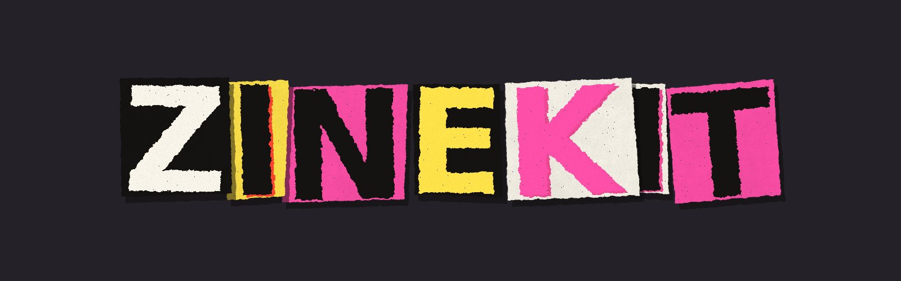
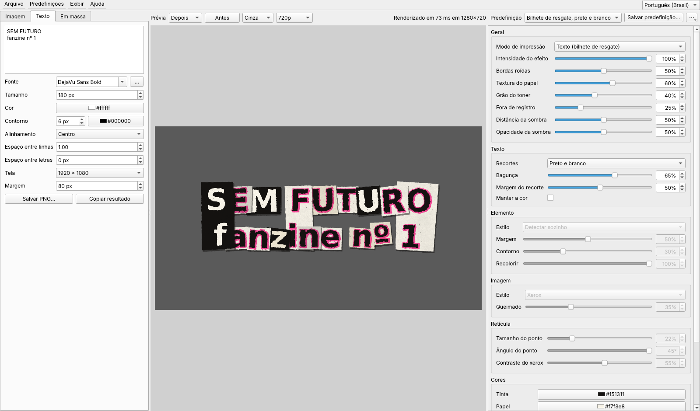
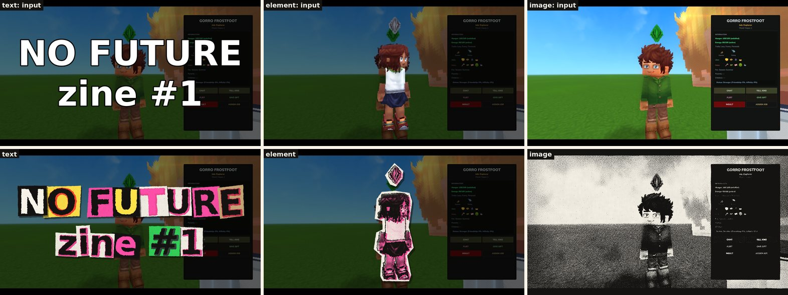
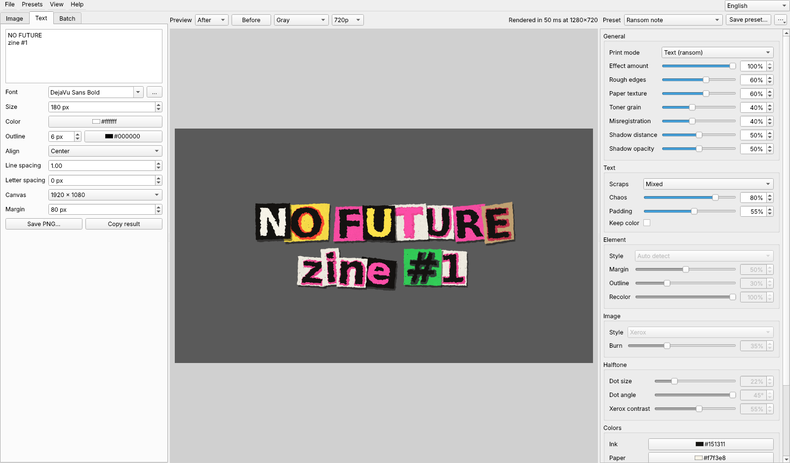
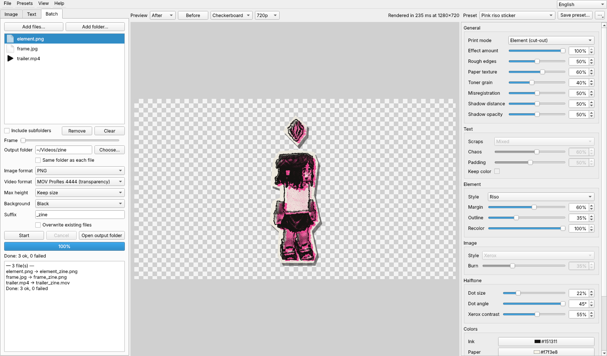
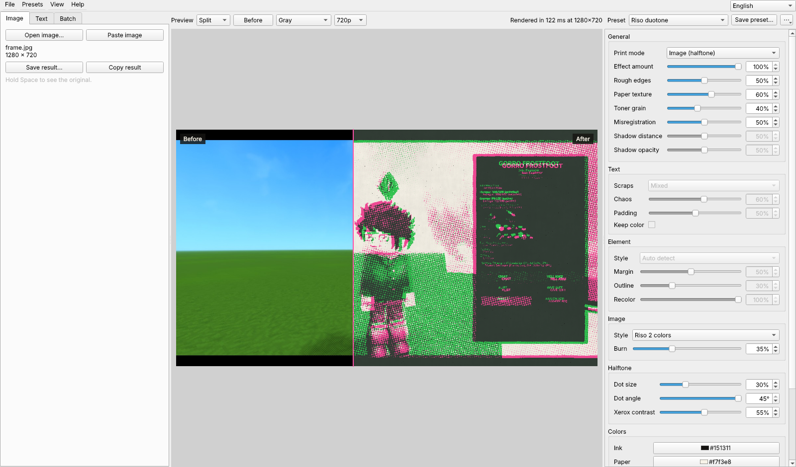
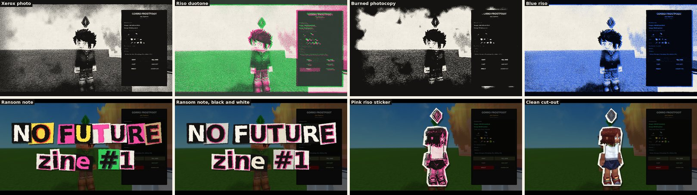

# zinekit

[English](README.md)



O zinekit transforma imagens, títulos digitados e pastas inteiras de imagens e vídeos em fanzine xerocado dos anos 70: letras de bilhete de resgate, adesivos recortados na tesoura, retícula de xerox e de riso.

O visual vem do **Punk Zine**, um filtro frei0r feito junto com o zinekit. O frei0r é o formato de plugin que ferramentas de vídeo como o ffmpeg e o MLT carregam, então o mesmo filtro também roda nelas. O zinekit traz o código C do filtro e compila na primeira vez; não precisa instalar mais nada.

São duas partes:

- **O editor** (Qt): imagem, título ou lote à esquerda, prévia ao vivo no meio e todos os parâmetros à direita. A prévia é refeita enquanto você arrasta o controle.
- **A linha de comando:** as mesmas impressões, predefinições e processamento em massa, para scripts.





## Sumário

- [Instalar e rodar](#instalar-e-rodar)
- [O editor](#o-editor)
- [Em massa: imagens e vídeos](#em-massa-imagens-e-vídeos)
- [Linha de comando](#linha-de-comando)
- [Parâmetros](#parâmetros)
- [Predefinições](#predefinições)
- [O mesmo visual no ffmpeg](#o-mesmo-visual-no-ffmpeg)
- [Como funciona](#como-funciona)
- [Desenvolvimento](#desenvolvimento)
- [Problemas comuns](#problemas-comuns)

## Instalar e rodar

Precisa de:

- Linux (no macOS deve funcionar também).
- Python 3.9 ou mais novo.
- Um compilador C (`gcc` ou `clang`). Ele é usado uma vez, para compilar o plugin.
- `ffmpeg` e `ffprobe`, para vídeos.

```sh
cd ~/Documents/tools/zinekit
./run.sh
```

Na primeira vez, o `run.sh` cria `.venv/` nesta pasta e instala **PySide6-Essentials** e **Pillow** (uns 100 MB de download). Depois o zinekit compila o plugin em `~/.cache/zinekit/`, o que leva alguns segundos. Das próximas vezes abre direto.

| comando | o que faz |
|---|---|
| `./run.sh` | abre o editor |
| `./run.sh foto.jpg` | abre o editor com essa imagem. Vários arquivos ou um vídeo vão para a aba Em massa. |
| `./run.sh apply …`, `./run.sh text …` | roda a [linha de comando](#linha-de-comando) |
| `./run.sh --install-desktop` | coloca o zinekit no menu de aplicativos |
| `./run.sh --selftest` | roda todos os testes, inclusive o editor na plataforma offscreen do Qt |
| `./run.sh --update` | reinstala ou atualiza os pacotes Python |

Para usar outro Python: `PYTHON=python3.12 ./run.sh`.

Para instalar como pacote normal:

```sh
python3 -m venv .venv && .venv/bin/pip install -e ".[gui]"
.venv/bin/zinekit          # ou zinekit-gui
```

## O editor

A coluna da esquerda escolhe o que imprimir, o meio mostra a prévia ao vivo e a coluna da direita tem os parâmetros e as predefinições.

### Aba Imagem

- **Abrir imagem…** (Ctrl+O), **Colar imagem** (Ctrl+Shift+V), ou arraste um arquivo para a janela.
- **Salvar resultado…** (Ctrl+S) renderiza em resolução cheia e grava PNG, JPEG, WebP ou TIFF. PNG, WebP e TIFF mantêm a transparência. O JPEG é achatado sobre a cor de *Fundo* da aba Em massa.
- **Copiar resultado** (Ctrl+Shift+C) põe a impressão em tamanho cheio na área de transferência.

### Aba Texto

Digite um título (pode ter várias linhas) e escolha:

- fonte (todas as instaladas, com busca, ou **…** para carregar um `.ttf`/`.otf`), tamanho, cor e contorno;
- alinhamento, espaço entre linhas e entre letras;
- tela: 1920×1080, 1280×720, 4K, quadrado, 4:5, 9:16 ou *Ajustar ao texto*; e margem.

O título é desenhado numa tela transparente, que é o que o modo texto do plugin precisa para recortar cada letra no seu próprio pedaço de papel. **Salvar PNG…** mantém a transparência, então o arquivo vai direto para uma trilha de um editor de vídeo.

O contorno é vazado no recorte em vez de achatado, então títulos com contorno continuam legíveis.



### Aba Em massa

Adicione arquivos ou pastas, ou solte na janela. Ao escolher um arquivo na lista, ele aparece na prévia com os parâmetros atuais. Num vídeo, o controle **Quadro** percorre o vídeo.

Depois escolha a pasta de saída, os formatos e o tamanho, e aperte **Começar**. Veja [Em massa: imagens e vídeos](#em-massa-imagens-e-vídeos).



### Prévia

| controle | |
|---|---|
| **Depois / Antes / Dividido** | Dividido mostra o original à esquerda e a impressão à direita; arraste na imagem para mover a linha |
| botão **Antes**, ou segurar **Espaço** | mostra o original enquanto segura |
| fundo | xadrez, preto, cinza ou branco atrás das impressões transparentes |
| **540p / 720p / 1080p / Completa** | a resolução em que a prévia é renderizada |



A prévia é renderizada numa thread separada, e só o pedido mais novo é renderizado. Arrastando um controle, a imagem acompanha em vez de acumular quadros velhos. O tempo de cada renderização aparece à direita.

Todas as medidas do efeito (célula da retícula, bordas roídas, sombra, margem dos recortes) acompanham o tamanho do quadro. Por isso uma prévia em 720p fica igual à renderização em resolução cheia.

### Painel de parâmetros

São todos os parâmetros do filtro, agrupados em Geral, Texto, Elemento, Imagem, Retícula, Cores e Layout. Cada um tem uma dica que diz o que faz e em qual modo vale.

- Os parâmetros que o **Modo de impressão** escolhido não usa ficam cinza (no *Detectar sozinho* todos ficam ativos).
- **Clique duas vezes no nome** para restaurar o padrão daquele parâmetro.
- Os controles só aceitam a rodinha do mouse depois de clicados, então rolar o painel nunca muda um valor sem querer.

### Atalhos

| teclas | |
|---|---|
| Ctrl+O | abrir imagem |
| Ctrl+Shift+V | colar imagem |
| Ctrl+S | salvar resultado |
| Ctrl+Shift+C | copiar resultado |
| Ctrl+1 / Ctrl+2 / Ctrl+3 | aba Imagem / Texto / Em massa |
| Espaço (segurar) | mostrar o original |
| Ctrl+Q | sair |

### Idioma

A interface está em inglês ou em português do Brasil. Troque na caixa de idioma no canto direito da barra de menus, ou em **Exibir → Idioma**. A janela é refeita no novo idioma na hora, mantendo a imagem aberta, a lista do lote e todas as opções. Na primeira vez ele segue o idioma do sistema; `ZINEKIT_LANG=pt_BR` ou `ZINEKIT_LANG=en` passa por cima. A linha de comando é sempre em inglês.

Nenhum texto da interface fica fixo no código. Todos vêm de `zinekit/locales/<código>.json`, um JSON simples que liga o texto em inglês à tradução, com `"_language"` como o nome que aparece no menu. Para acrescentar um idioma, copie `en.json` para, por exemplo, `es.json`, traduza os valores e reinicie; ele aparece no menu sozinho. O `tests/test_i18n.py` falha quando um arquivo não tem algum texto, guarda um que o código não usa mais ou muda um `%s`/`%d`.

O editor lembra os parâmetros, a predefinição, o texto e as opções do lote entre uma sessão e outra, em `~/.config/zinekit/zinekit.conf`.

## Em massa: imagens e vídeos

Entradas:

- **Imagens:** png, jpg, webp, bmp, tif, tga. A rotação do EXIF é aplicada.
- **Vídeos:** tudo que o ffmpeg lê (mp4, mov, mkv, webm, avi, gif, …). A rotação de celular é aplicada, e a transparência de VP9/ProRes/PNG é mantida.

Saídas de imagem:

| formato | transparência |
|---|---|
| PNG | ✓ |
| JPEG | achatada sobre o *Fundo* |
| WebP | ✓ |
| TIFF | ✓ |
| Igual à origem | igual ao formato de origem |

Saídas de vídeo:

| formato | transparência | áudio | observação |
|---|---|---|---|
| MP4 H.264 | achatada sobre o *Fundo* | AAC, copiado do original | toca em qualquer lugar |
| MOV ProRes 4444 | ✓ | PCM | para edição; editores de vídeo leem o alfa |
| WebM VP9 | ✓ | Opus | pequeno, com alfa |
| Sequência PNG | ✓ | nenhum | uma pasta de `frame_000001.png` |
| GIF | ✓ (1 bit) | nenhum | paleta feita a partir do vídeo |

Opções:

- **Altura máxima** reduz (nunca aumenta). Os tamanhos de vídeo ficam pares para o H.264.
- **Fundo** é a cor embaixo das áreas transparentes nos formatos sem alfa: preto, branco ou a cor do papel.
- **Sufixo** vai no nome do arquivo (`clip.mp4` → `clip_zine.mp4`). Um arquivo que já existe nunca é substituído, a não ser com **Sobrescrever** ligado; o novo vira `clip_zine-2.mp4`.
- **Mesma pasta de cada arquivo** grava do lado das entradas.

Comportamento:

- Um arquivo que dá erro aparece no log, e o lote segue para o próximo.
- Arquivos de imagem e vídeo são gravados como um arquivo oculto `.nome.part…` e só renomeados quando terminam. **Cancelar** para o ffmpeg e apaga esse arquivo parcial; os quadros de uma sequência PNG cancelada ficam na pasta.
- A velocidade num vídeo depende da resolução e da CPU. Numa máquina de 2 núcleos, um quadro 720p leva uns 80 ms. O plugin usa até 8 threads por quadro, e o ffmpeg decodifica e codifica ao mesmo tempo.

## Linha de comando

`zinekit` sem comando abre o editor. Rode como `./run.sh …`, como `.venv/bin/zinekit …` depois de instalar com pip, ou como `python3 -m zinekit …`.

```sh
# uma imagem, um arquivo de saída (a extensão escolhe o formato)
zinekit apply foto.jpg -o foto_zine.png -p "Xerox photo" -s dot_size=40

# uma pasta de imagens e vídeos para outra pasta
zinekit apply ~/Videos/clipes -o ~/Videos/zine --video-format mov --max-height 1080 -r

# um título em letras de bilhete de resgate, num PNG 1080p transparente
zinekit text "NO FUTURE\nzine #1" -o titulo.png --font "DejaVu Sans Bold" --size 200 --stroke 6

# só a camada do título, sem o efeito
zinekit text "NO FUTURE" -o liso.png --plain

zinekit params              # todos os parâmetros, padrão, valores e onde se aplicam
zinekit presets             # as predefinições; 'zinekit presets "Riso duotone"' mostra uma em JSON
zinekit fonts bold          # fontes instaladas com "bold" no nome
zinekit ffmpeg -p "Blue riso"   # o mesmo visual como filtro do ffmpeg
zinekit doctor              # compilador, plugin, codificadores do ffmpeg, PySide6
zinekit build --force       # recompila o plugin
```

`-s/--set NOME=VALOR` usa os valores do jeito que o editor mostra:

| tipo | exemplo |
|---|---|
| porcentagem | `-s roughness=80` (ou `80%`) |
| graus | `-s dot_angle=30` |
| itens de lista, pelo nome | `-s mode=text`, `-s image_style=riso2`, `-s scrap_palette=bw` |
| liga/desliga | `-s keep_text_color=on` |
| cores | `-s ink=#000000` |
| semente (0–1000) | `-s seed=42` |

`-p/--preset` aceita o nome de uma predefinição ou um arquivo `.json`. A predefinição é aplicada primeiro, depois cada `-s`.

`zinekit apply` sai com 0 quando todos os arquivos deram certo e 1 quando algum falhou. Argumentos errados saem com 2.

## Parâmetros

O nome no painel em português e, entre parênteses, com a interface em inglês.

| nome | no painel | padrão | valores | vale para |
|---|---|---|---|---|
| `mode` | Modo de impressão (Print mode) | Detectar sozinho | auto, text, element, image | todos |
| `mix` | Intensidade do efeito (Effect amount) | 100% | 0–100% | todos |
| `roughness` | Bordas roídas (Rough edges) | 50% | 0–100% | todos |
| `paper_texture` | Textura do papel (Paper texture) | 60% | 0–100% | todos |
| `grain` | Grão do toner (Toner grain) | 40% | 0–100% | todos |
| `misregistration` | Fora de registro (Misregistration) | 40% | 0–100% | todos (imagem: estilos riso) |
| `shadow` | Distância da sombra (Shadow distance) | 50% | 0–100% | texto, elemento |
| `shadow_opacity` | Opacidade da sombra (Shadow opacity) | 50% | 0–100% | texto, elemento |
| `scrap_palette` | Texto → Recortes (Text → Scraps) | Misturado | mixed, bw, plate, plate2, none | texto |
| `chaos` | Texto → Bagunça (Text → Chaos) | 60% | 0–100% | texto |
| `scrap_padding` | Texto → Margem do recorte (Text → Padding) | 50% | 0–100% | texto |
| `keep_text_color` | Texto → Manter a cor (Text → Keep color) | desligado | on, off | texto |
| `element_style` | Elemento → Estilo (Element → Style) | Detectar sozinho | auto, riso, palette, xerox, original | elemento |
| `cut_margin` | Elemento → Margem (Element → Margin) | 50% | 0–100% | elemento |
| `outline` | Elemento → Contorno (Element → Outline) | 30% | 0–100% | elemento |
| `recolor` | Elemento → Recolorir (Element → Recolor) | 100% | 0–100% | elemento |
| `image_style` | Imagem → Estilo (Image → Style) | Xerox | xerox, riso, riso2, photocopy | imagem |
| `burn` | Imagem → Queimado (Image → Burn) | 35% | 0–100% | imagem |
| `dot_size` | Retícula → Tamanho do ponto (Dot size) | 22% | 0–100% | elemento, imagem |
| `dot_angle` | Retícula → Ângulo do ponto (Dot angle) | 45° | 0–45° | elemento, imagem |
| `contrast` | Retícula → Contraste do xerox (Xerox contrast) | 55% | 0–100% | elemento, imagem |
| `ink` | Tinta (Ink) | `#151311` | cor | todos |
| `paper` | Papel (Paper) | `#f7f3e8` | cor | todos |
| `color1` | Cor da chapa (Plate color) | `#ff4fa8` | cor | todos |
| `color2` | Cor da chapa 2 (Plate color 2) | `#35d45b` | cor | todos |
| `color3` | Cor do recorte (Scrap color) | `#ffe24a` | cor | texto, elemento |
| `seed` | Semente do layout (Layout seed) | 1 | 0–1000 | todos |

O *Detectar sozinho* escolhe por imagem:

- muitas peças separadas sobre transparência: **texto**;
- uma peça sobre transparência: **elemento**;
- sem transparência: **imagem**.

Os algoritmos de cada modo estão descritos no README do plugin, no fork do frei0r (`src/filter/punkzine/README.md` na branch `filter/punkzine`).

## Predefinições

Predefinições embutidas (na linha de comando vale o nome em português ou em inglês, por exemplo `-p "Riso duas cores"` ou `-p "Riso duotone"`):

- Padrão
- Bilhete de resgate
- Bilhete de resgate, preto e branco
- Adesivo riso rosa
- Recorte limpo
- Foto xerox
- Riso duas cores
- Fotocópia queimada
- Riso azul



No editor:

- **Salvar predefinição…** guarda os valores atuais como uma predefinição sua.
- O menu **⋯** apaga, importa e exporta predefinições, restaura tudo ou copia o filtro do ffmpeg.
- *(alterada)* aparece quando o painel não bate mais com a predefinição escolhida.

As predefinições do usuário são arquivos JSON em `~/.config/zinekit/presets/` (`$XDG_CONFIG_HOME` é respeitado; `ZINEKIT_CONFIG` muda a pasta inteira). Uma predefinição só lista o que muda em relação ao padrão, em unidades do plugin: números de 0 a 1, listas como valores igualmente espaçados, cores em hexadecimal.

```json
{
  "zinekit": 1,
  "name": "Riso duotone",
  "params": {"mode": 1.0, "misregistration": 0.5, "image_style": 0.666667, "dot_size": 0.3}
}
```

## O mesmo visual no ffmpeg

`zinekit ffmpeg` (ou **⋯ → Copiar filtro do ffmpeg**) mostra o filtro frei0r com todos os parâmetros na ordem.

```sh
FREI0R_PATH=~/.cache/zinekit/frei0r-1 ffmpeg -i in.mp4 -vf "format=rgba,$(zinekit ffmpeg -p 'Riso duotone')" out.mp4
```

`~/.cache/zinekit/frei0r-1/punkzine.so` sempre aponta para a compilação atual (`zinekit build` mostra o caminho). Com os mesmos pixels de entrada, a saída do ffmpeg e a do zinekit diferem em no máximo 1/255 por canal. Outros hosts frei0r (o MLT, por exemplo) carregam o mesmo módulo dessa pasta.

## Como funciona

```
zinekit/
├── native/punkzine.c   o plugin frei0r (copiado, veja native/README.md)
├── engine.py           compila uma vez em ~/.cache/zinekit e carrega com ctypes
├── params.py           os 27 parâmetros: nomes, grupos, unidades, leitura da linha de comando
├── presets.py          predefinições embutidas e do usuário (JSON)
├── textlayer.py        desenha um título numa tela transparente (Pillow)
├── fonts.py            fontes instaladas (fc-list, ou varredura das pastas de fontes)
├── media.py            ffprobe / ffmpeg: dados do vídeo, quadros soltos, codificadores
├── batch.py            imagens com Pillow, vídeos por pipes do ffmpeg
├── preview.py          a thread de fundo que sempre renderiza o pedido mais novo
├── cli.py              a linha de comando
├── i18n.py             tr(): procura os textos em locales/
├── locales/            en.json, pt_BR.json (um arquivo por idioma)
└── gui/                o editor em PySide6
```

- **Motor.** `native/punkzine.c` é compilado com `cc -O3 -fPIC -shared` em `~/.cache/zinekit/punkzine-<hash>.so`, e só é recompilado quando o código muda. O módulo é carregado do jeito que um host frei0r carrega: `f0r_construct`, `f0r_set_param_value`, `f0r_update`. O ctypes solta o GIL durante o `f0r_update`, então a renderização roda em paralelo com a interface. Sem compilador, o zinekit usa um `punkzine.so` que já esteja numa das pastas comuns do frei0r (`~/.frei0r-1/lib`, `/usr/lib/frei0r-1`, …) ou o arquivo apontado por `ZINEKIT_PLUGIN`.
- **Vídeo.** Um ffmpeg decodifica a entrada em quadros RGBA crus: taxa de quadros constante, escalados, com a rotação aplicada. O plugin imprime cada quadro. Um segundo ffmpeg codifica os quadros e copia a trilha de áudio do original. Leitura, impressão e escrita rodam em três threads.
- **Prévia.** A origem é reduzida para o tamanho da prévia uma vez. Cada mudança de parâmetro manda um trabalho para uma thread; os trabalhos que ainda estão esperando são trocados pelo mais novo. A instância do plugin é mantida por tamanho de quadro, então o modo elemento reaproveita o recorte entre uma renderização e outra.

## Desenvolvimento

```sh
python3 -m unittest discover -s tests -t .       # todos os testes (precisa do Pillow; ffmpeg para os de vídeo)
./run.sh --selftest                              # o mesmo dentro do venv, com o editor
python3 docs/make_examples.py                    # refaz as impressões de exemplo em docs/images
QT_QPA_PLATFORM=offscreen .venv/bin/python docs/make_screenshots.py   # tira de novo as capturas do editor
```

- **Os testes** cobrem o motor contra a tabela de parâmetros do plugin e os modos, parâmetros e predefinições, a camada de texto, lotes de imagem e todos os formatos de vídeo (alfa, áudio, escala, cancelar), a thread da prévia e a linha de comando.
- **`tests/test_gui_smoke.py`** usa a janela do editor de ponta a ponta. Com o PySide6 instalado, ele usa os widgets de verdade na plataforma offscreen do Qt. Sem ele, roda em `tests/fakeqt/`, um substituto que executa a lógica do editor mas não confere a API do Qt.
- **Atualizar o plugin:** copie `src/filter/punkzine/punkzine.c` do fork do frei0r para `zinekit/native/`. Se os parâmetros mudaram, atualize também `params.py` (`PARAMS`, `PLUGIN_ORDER`). O `tests/test_engine.py` falha quando a tabela e o plugin não batem.

## Problemas comuns

- **"no C compiler found":** instale um (`sudo pacman -S gcc`, `sudo apt install build-essential`, `sudo dnf install gcc`). Se você já tem uma compilação do filtro, `ZINEKIT_PLUGIN=/caminho/para/punkzine.so` usa ela.
- **O editor não abre e o Qt fala de "xcb":** o PySide6 6.5+ precisa de `libxcb-cursor0` no X11 (`sudo apt install libxcb-cursor0`). No Wayland, dá para tentar `QT_QPA_PLATFORM=wayland ./run.sh`.
- **O pip não encontra o PySide6:** seu Python pode ser novo demais para os pacotes do PySide6. Tente `PYTHON=python3.12 ./run.sh --update`.
- **Os vídeos são pulados:** instale o ffmpeg. Depois rode `./run.sh doctor` para ver os codificadores encontrados. Sem libx264, o MP4 usa OpenH264 ou MPEG-4.
- **A prévia parece não mudar:** confira a **Intensidade do efeito** e se o parâmetro não está cinza no **Modo de impressão** escolhido.

## Licença

MIT, veja [LICENSE](LICENSE). O plugin Punk Zine em `zinekit/native/` também é MIT.
